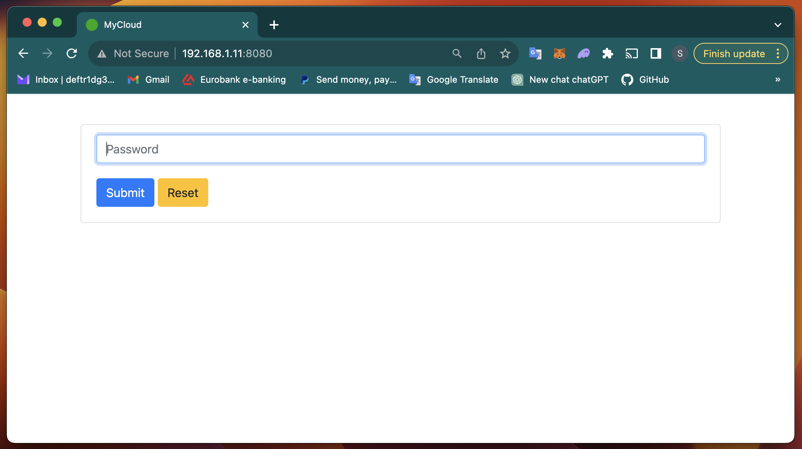
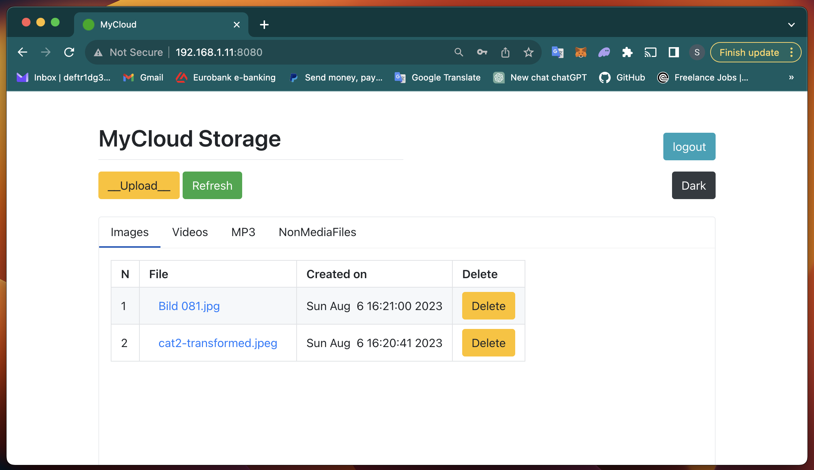

# MyCloud App

Very simple app. Main purpose to be a private Cloude storage,
that works from home PC via PyWebIO server to WAN.
(Also can be tunneled using "ngrok")

1. Insert password page

2. App main display

App creates "Data" folder with four folders inside - "Images", "mp3", "Videos", "NonMediaFiles
in the directory the script is launched in.
In those folders script will store uplodaed files depending on its extension, sorted by creation time.

To make the server to be visible from WAN uncomment and use:

    - start_server(main, port=8080, remote_access=True)

    in mian.py

    remote_access=True starts the WAN server and displayes its address in the shell.
    For example:

    Remote access address will be like: https://3xzepr3um5fw.app.pywebio.online

    The address every time is different.

P.S.
The script is written without using design patterns and clean code rules.
I worte it for myself in one file, once I needed it to be ready fast.
Once I will find enough time, I will refactor the code to make it scalable. 